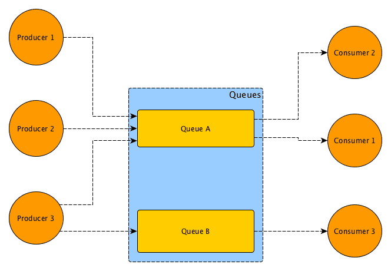

<!-- class: invert -->

<!-- _class:
- lead
- invert
-->

Spokane Python User Group

# Background Task Processing:

## Celery vs. Dramatiq

Joseph Riddle

---

<!--
_class:
  - invert
  - lead
-->

# Raffle

Feedback for free JetBrains

https://forms.office.com/r/EFnAfpu3Ue

---

# Outline

- Definitions
- What is Celery
- What is Dramatiq
- Celery vs. Dramatiq
- Demo

---

# Message

A unit of communcation between computer processes.

# Task

An asynchronous unit of work.

---

# Message Queue

Provides fast asynchronous communication between software components.

Temporarily stores messages, with endpoints for software services to connect to the queue.

---

https://better.engineering/message-queues/

---

# Message Broker

An architectural pattern for message validation, transformation, and routing.

**Decoupled communication.**

Popular message brokers include [RabbitMQ](https://www.rabbitmq.com/), [Apache Kafka](https://kafka.apache.org/), and more...

Cloud provider options include [Amazon MSK](https://aws.amazon.com/msk/), [Azure Event Hubs](https://azure.microsoft.com/en-us/services/event-hubs/), [Google Pub/Sub](https://cloud.google.com/pubsub/docs/overview), and more...

<!-- A message broker is software that enables applications, systems, and services to communicate with each other and exchange information. -->

---

# [RabbitMQ](https://www.rabbitmq.com/)

> RabbitMQ is the most widely deployed open source message broker.
>
> https://www.rabbitmq.com/

Supports AMQP and others

[Official Docker image](https://hub.docker.com/_/rabbitmq)

---

# [AMQP](https://www.amqp.org/)

The Advanced Message Queuing Protocol (AMQP) is an open standard for passing business messages between applications or organizations.  

[AMQP Primer](https://docs.celeryproject.org/en/stable/userguide/routing.html#id1)

[ISO 19464](https://www.iso.org/standard/64955.html)

---

# [Redis](https://redis.io/)

An open-source, networked, in-memory, key-value data store with optional durability.

[Can be used as a message broker](https://redis.io/topics/pubsub).

[Official Docker image](https://hub.docker.com/_/redis)

---

# [Celery](https://docs.celeryproject.org/en/stable/getting-started/introduction.html)

Celery is an open source asynchronous task queue or job queue which is based on distributed message passing. While it supports scheduling, its focus is on operations in real time.

The _de facto_ Python task queue library.

GitHub repo created in 2009

17.7K⭐

---

# [Dramatiq](https://dramatiq.io/)

Dramatiq is a background task processing library for Python with a focus on simplicity, reliability and performance. Created by a user of Celery.

Pronounced the same as "dramatic".

GitHub repo created in 2017

2.7K⭐

---

# Use Cases

- Background tasks for web API
- Distributed machine learning batch job

---

## Celery vs. Dramatiq

|                      | Celery                                                      | Dramatiq                                     |
|----------------------|-------------------------------------------------------------|----------------------------------------------|
| Broker Support       | RabbitMQ  Redis  Amazon SQS  more...               | RabbitMQ  Redis  In-memory  more... |
| Result Store Support | Redis  Memcached  MongoDB  File system  more... | Redis  Memcached                          |

---

## Celery vs. Dramatiq

|                      | Celery                                                      | Dramatiq                                     |
|----------------------|-------------------------------------------------------------|----------------------------------------------|
| Scheduling           | Celery Beat                                                 | Accomplished via APScheduler                 |
| Monitoring           | Flower                                                   | Yes *                                        |
| Chaining             | Yes                                                         | Yes                                          |

https://dramatiq.io/motivation.html

<!-- Dramatiq monitoring has a few options, including "dramatiq tasks with monitoring" and "dramatiq dashbord", but neither as good as Flower -->

---

<!--
_class:
  - invert
  - lead
-->

# Raffle

Feedback for free JetBrains

https://forms.office.com/r/EFnAfpu3Ue

---

# Other Python Message Queue projects

- [RQ (Redis Queue)](https://python-rq.org/)  Simple + Redis
- [Taskmaster](https://github.com/dcramer/taskmaster)  Simple + One-off tasks
- [Huey](https://huey.readthedocs.io/en/latest/)  Lightweight + Redis
- [Kuyruk](https://kuyruk.readthedocs.io/en/latest/)  Simple + RabbitMQ
- [Django Carrot](https://github.com/chris104957/django-carrot)  Simple + Django

See https://www.fullstackpython.com/task-queues.html

---

<!-- _class:
- lead
- invert
-->

# Questions?

---

# References

https://better.engineering/message-queues/

https://github.com/cthtuf/dramatiq-tasks-with-monitoring/blob/master/docker-compose.yml
