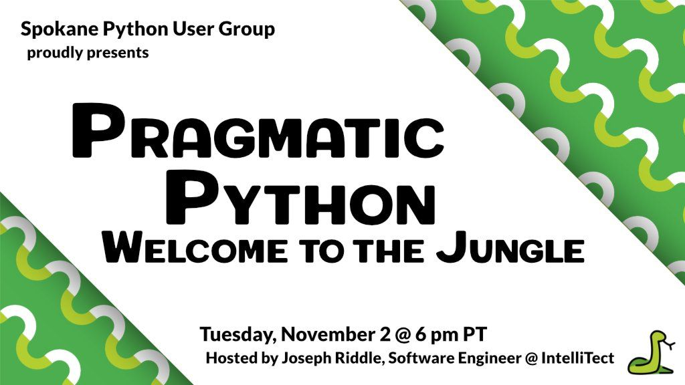

# Spokane Python User Group

## About

Welcome to home of the Spokane Python User Group (_SPUG_), Spokane's premiere local Python user group! We have a wide range of topics all related to Python, Web Development, and Open Source technology. We're currently meeting on the first Tuesday of each month.

All meetings are free, and we encourage everyone to participate and get involved and help grow the Python community. We try to base our meetings from attendee suggestions. If you have an idea for a topic that you would like to see (or present), please let the organizers know!

Our meetups events are managed on [Meetup](https://www.meetup.com/Python-Spokane/).

---

## Upcoming Meetups

### Pragmatic Python: Welcome to the Jungle

_November 2, 2021_ | [Meetup](https://www.meetup.com/Python-Spokane/events/281578925/) | [Code Samples](https://github.com/IntelliTect-Samples/SpokanePythonUserGroup/tree/main/2021.11.04-Pragmatic-Python-1)

After taking a month (or two) off for my wedding, we're back at it again for November with a brand spanking new series dubbed _"Pragmatic Python"_!

> Welcome to Pragmatic Python, a new series of meetups that will focus on building your Python knowledge from the ground up. For the next several meetups, we'll focus on taking you from a small garter snake all the way to a full-fledged, certified* Python-ista! 🐍
> 
> This month's meetup, "Welcome to the Jungle", will focus on getting started with Python. Topics will include installing python, writing basic scripts, a look at popular libraries, and more!
> 
> Stay tuned for more info...
> 
> \* There will be no certification exam 😉

---

## Previous Meetups

---

### Mk’ing spokanepython.com: Static Site Generation with MkDocs

_August 24, 2021_ | [Meetup](https://www.meetup.com/Python-Spokane/events/280103526/) | [Code Samples](https://github.com/IntelliTect-Samples/SpokanePythonUserGroup/tree/main/2021.08.24-MkDocs)

<iframe width="400" height="225" src="https://www.youtube-nocookie.com/embed/eJVVbZYUYro/?showinfo=0&rel=0" title="YouTube video player" frameborder="0" allow="accelerometer; autoplay; clipboard-write; encrypted-media; gyroscope; picture-in-picture" allowfullscreen></iframe>

> In this month's meetup, we'll explore create documentation using popular static site generator, MkDocs! We'll learn about getting started with MkDocs, customizing the look and feel of your site, and hosting an online website using MkDocs!

---

### [Background Task Processing: Celery vs. Dramatiq](2021-07-Background-Task-Processing.md)

_July 27, 2021_ | [Meetup](https://www.meetup.com/Python-Spokane/events/279452049/) | [Code Samples](https://github.com/IntelliTect-Samples/SpokanePythonUserGroup/tree/main/2021.07.27-Background-Tasks)

> Come learn how to do background task processing in Python using popular libraries Celery, Dramatiq, and more!

---

### [Kubernetes (Spokane DevOps Meetup)](2021-07-Kubernetes.md)

_July 15, 2021_ | [Meetup](https://www.meetup.com/Spokane-DevOps-Meetup/events/278709256/) | [Code Samples](https://github.com/IntelliTect-Samples/SpokanePythonUserGroup/tree/main/2021.07.15-Kubernetes)

As a guest co-host for Spokane's DevOps Meetup, I talked briefly about how to run a FastAPI application using Kubernetes.

---

### [Typing for Fun and Profit](2021-06-Typing-for-Fun-and-Profit.md)

_June 15, 2021_ | [Meetup](https://www.meetup.com/Python-Spokane/events/278681498/) | [Code Samples](https://github.com/IntelliTect-Samples/SpokanePythonUserGroup/tree/main/2021.06.15-Typing)

<iframe width="400" height="225" src="https://www.youtube-nocookie.com/embed/OUq_qrf-Ro0/?showinfo=0&rel=0" title="YouTube video player" frameborder="0" allow="accelerometer; autoplay; clipboard-write; encrypted-media; gyroscope; picture-in-picture" allowfullscreen></iframe>

> Why can you reassign a variable from a string to an integer in Python but not some other languages? Is Python a typed language? Is Python strongly or weakly typed? Does it using static or dynamic typing? What's the Typing module all about? Are there other options than MyPy for type checking (heck, what _is_ MyPy)? What is duck typing???
> 
> These are all questions I've asked myself at some point or another. In this month's Python User Group Meetup, we're going to dive into all things typing related.
> 
> The goal is you come out the other end of this meetup having answers to all these questions and more, and to be able to answer the question "Do I want to use typing tools in my Python projects?"

---

### [Getting Started with FastAPI](2021-05-Getting-Started-with-FastAPI.md)

_May 18, 2021_ | [Meetup](https://www.meetup.com/Python-Spokane/events/278050092/) | [Code Samples](https://github.com/IntelliTect-Samples/SpokanePythonUserGroup/tree/main/2021.05.18-FastAPI)

> Do you want to learn about using a web framework in Python?
> Are you tired of using Flask and looking for something more?
> Have you used Django but want to try something new?
> 
> Then join us Tuesday, May 18th to learn about how to get started with one of the fastest-growing Python web frameworks, FastAPI! According to the 2020 Python Developers Survey, FastAPI is the third most popular web framework.
> 
> https://fastapi.tiangolo.com/
FastAPI is a modern, fast (high-performance), web framework for building APIs with Python 3.6+ based on standard Python-type hints.
